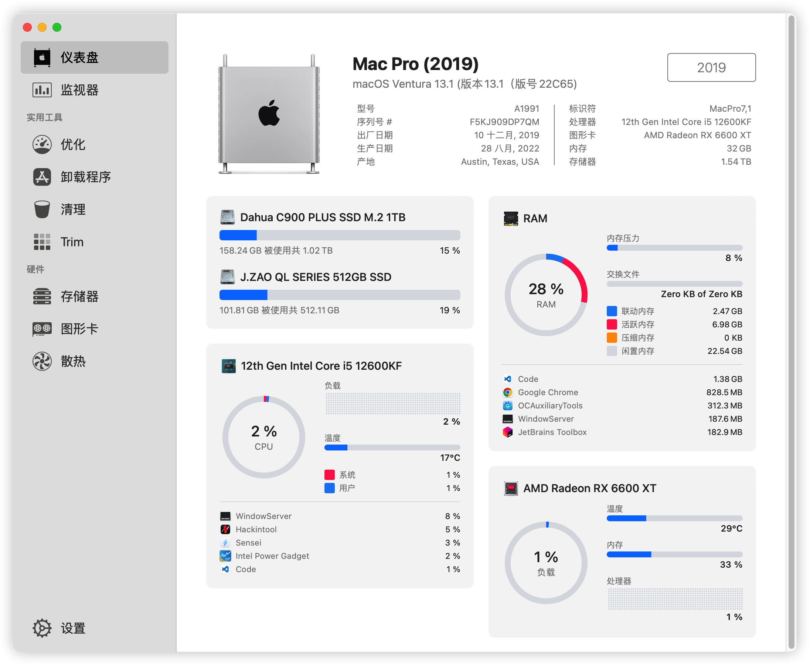
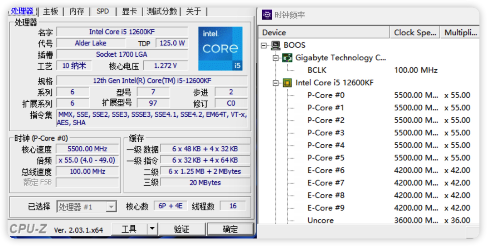
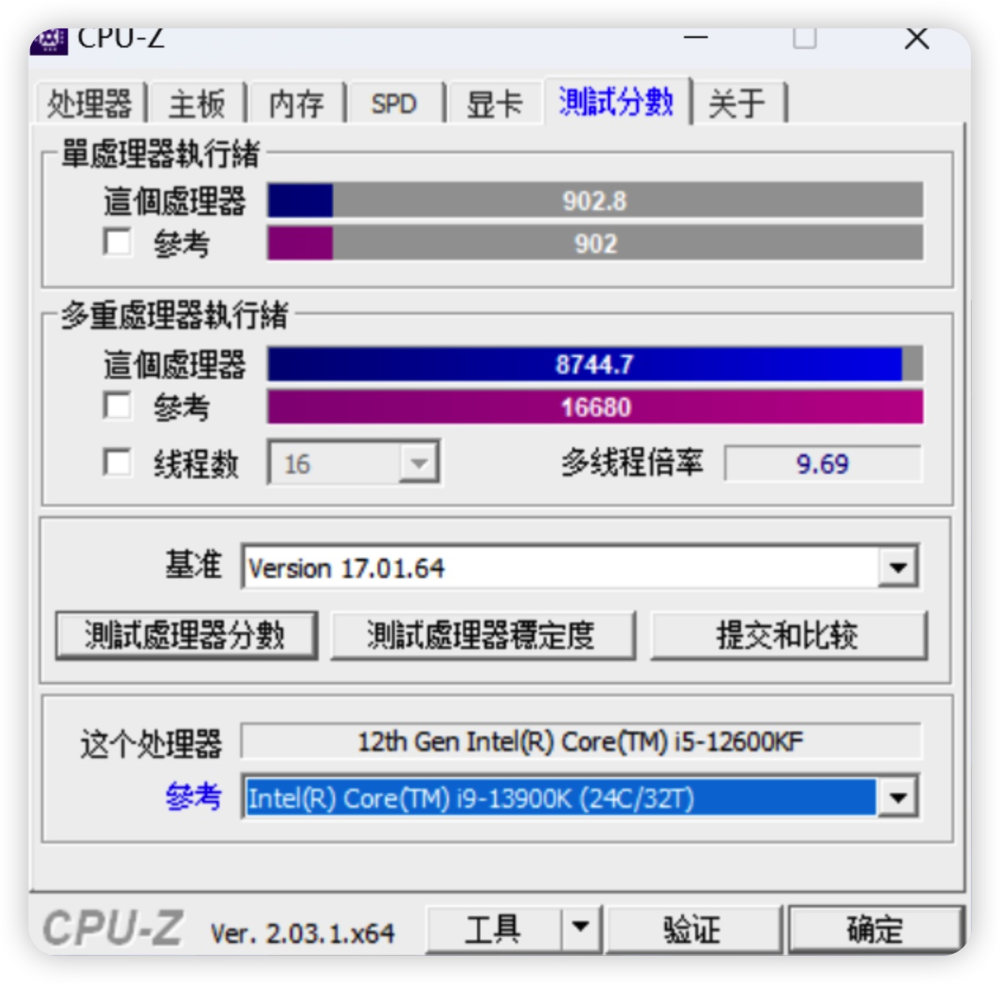
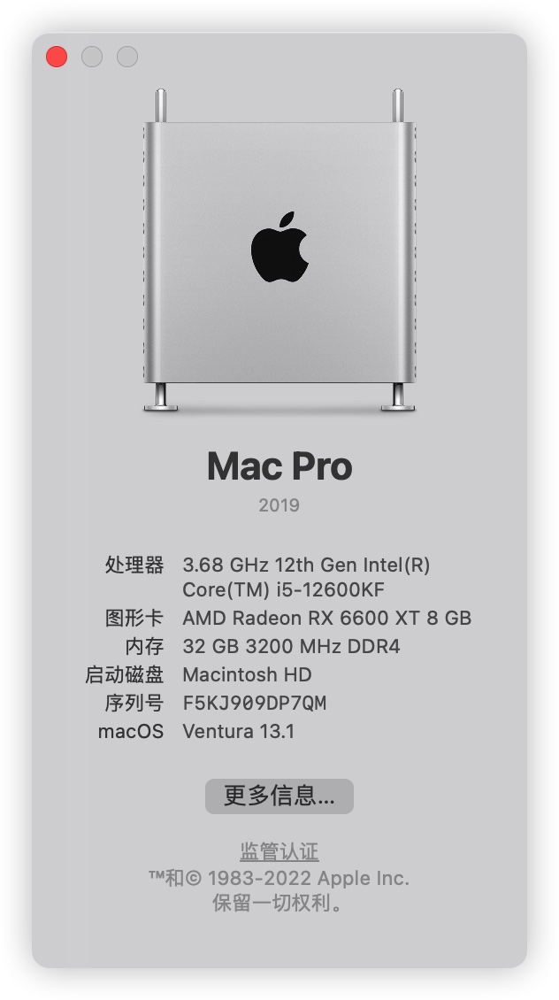
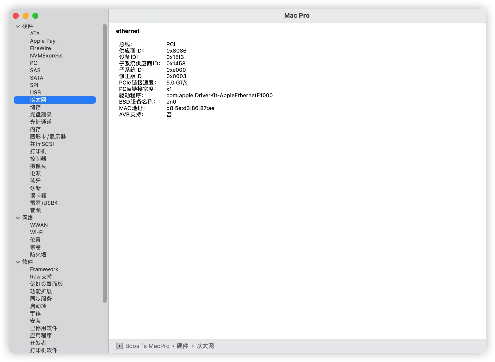

# Gigabyte Z690I Aorus Ultra PLUS **/** LITE DDR4 Hackintosh Ventura EFI 
### Opencore 0.8.9 With MacOS 13.* Only

## Motherboard Buy Link: [PLUS Version](https://www.amazon.com/-/zh/dp/B09ZKJ3SQ7) **/** [LITE Version](https://www.amazon.com/-/zh/dp/B0B29JCSGN)
- **CPU**: 12600KF OC to P 5.5G E 4.2G Ring 4.0G Fixed Mode 1.26V ~ 1.28V  

**CPU-Z Score**  

- **GPU**: Sapphire AMD Radeon RX 6600XT 8 GB NITRO+  
- **WIFI Card**: On Board Killer AX1650i  

## Bios Setting
- **Bios Version**: F22 `PICE4.0 with PCI-E 4.0 Riser Should Use F2`  
- CFG-Lock - OFF
- VT-d - **ON**  Important Setting `Dont Enable` **DisableloMapper**
- CSM - OFF
- VT-x - ON
- Above 4G decoding - ON
- Re-Size BAR Support - ON

## About Setting
Why Enabling VT-D here?  
Because I255-V In Need E1000.

## For Thanks
**[glekner](https://github.com/glekner/GIGABYTE-Z690I-Hackintosh)**